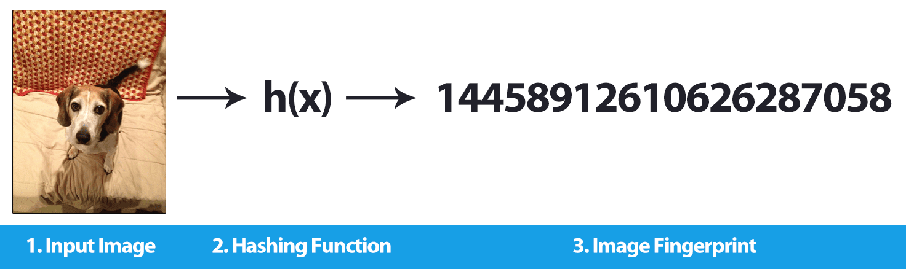
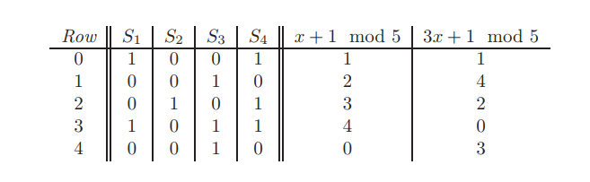
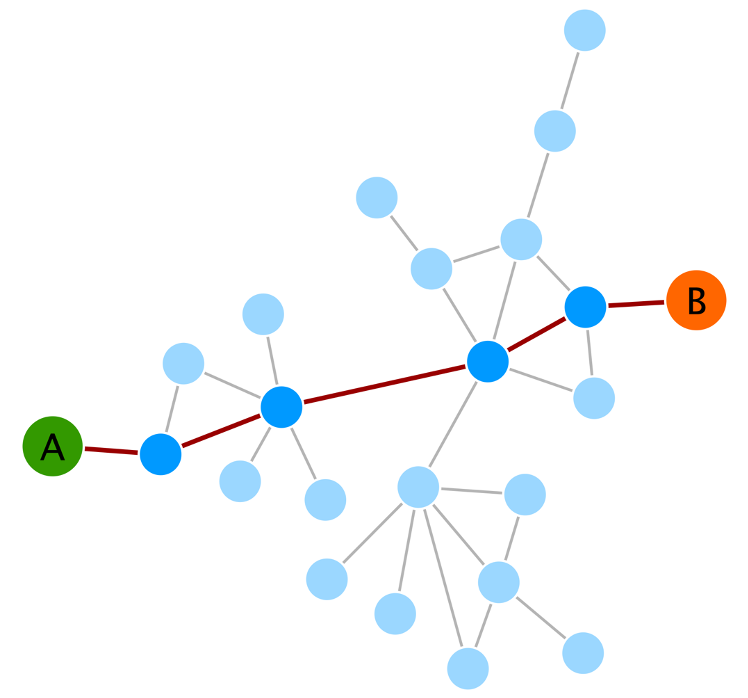
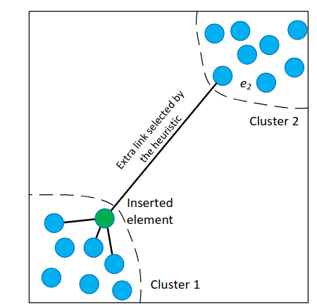
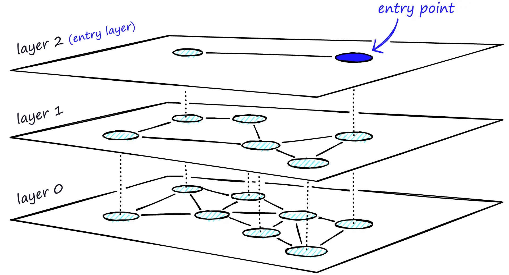

<!--toc:start-->
- [Introduction](#introduction)
  - [What is "finding similar items"](#what-is-finding-similar-items)
  - [Specific/real-world applications](#specificreal-world-applications)
    - [Recommendation system](#recommendation-system)
    - [Plagiarism/duplicate detection](#plagiarismduplicate-detection)
    - [Reverse image search](#reverse-image-search)
- [Data representation](#data-representation)
  - [Vector embeddings](#vector-embeddings)
  - [Hashing/signature](#hashingsignature)
    - [Characteristic matrix:](#characteristic-matrix)
    - [Minhashing a set](#minhashing-a-set)
    - [Minhashing and Jaccard similarity](#minhashing-and-jaccard-similarity)
    - [Finally, Signature](#finally-signature)
    - [Actually computing minhash signatures](#actually-computing-minhash-signatures)
- [What is "similarity", how are items considered similar](#what-is-similarity-how-are-items-considered-similar)
- [Similarity search techniques](#similarity-search-techniques)
  - [Brute force](#brute-force)
  - [KD (k-dimensional) tree](#kd-k-dimensional-tree)
  - [Ball tree](#ball-tree)
  - [Locality-sensitive hashing](#locality-sensitive-hashing)
    - [Tổng quan về Locality-sensitive families:](#tổng-quan-về-locality-sensitive-families)
    - [Tổng quan về Locality-sensitive hashing:](#tổng-quan-về-locality-sensitive-hashing)
    - [Locality-sensitive hashing cho minhash signatures:](#locality-sensitive-hashing-cho-minhash-signatures)
      - [Shingling và Minhashing:](#shingling-và-minhashing)
      - [Kĩ thuật phân dải (banding):](#kĩ-thuật-phân-dải-banding)
      - [Triển khai:](#triển-khai)
  - [K-NNG](#k-nng)
    - [NN-Descent](#nn-descent)
    - [K-NN search on a K-NNG](#k-nn-search-on-a-k-nng)
    - [Insertion & Deletion](#insertion-deletion)
      - [Local update](#local-update)
      - [Periodical rebuild](#periodical-rebuild)
    - [Summary](#summary)
  - [Navigable Small-World Graph](#navigable-small-world-graph)
  - [Hierarchical Navigable Small World Graph](#hierarchical-navigable-small-world-graph)
    - [Search](#search)
    - [Insertion](#insertion)
    - [Deletion](#deletion)
      - [Deletion flag](#deletion-flag)
      - [Hard deletion](#hard-deletion)
    - [Complexity and Effects of parameters](#complexity-and-effects-of-parameters)
  - [Product quantization](#product-quantization)
<!--toc:end-->

***Finding similar items***

# Introduction
## What is "finding similar items"
[See](intro-what-is-finding-similar.md)

## Specific/real-world applications
### Recommendation system

+ Popularly used in many domains & system
+ Example features:
    + "Users who viewed this items also viewed:"
    + "Similar items:"
+ Examples of how they work:
    + Retrieves recommendations based on user's preferred items
    + Retrieves recommendations based on other similar users

### Plagiarism/duplicate detection

+ Determine the level of similarity between a document and an existing one
+ Lexical similarity: simple exact/near exact text matching
+ Structure/syntactic similarity: structure/ordering of words, sentences or paragraphs
+ Sematic similarity: meaning of words and sentences

### Reverse image search

+ Find photos/images similar to input one
+ Remove noises
+ Measure similarity by color, shapes, layout, objects, etc

# Data representation
real-world data are almost never of primitive types (simple numeric, categorical, etc) => Need to represent data in a format so that similarity measurement & searching techniques can be applied

## Vector embeddings

+ Numeric vector/array, eg,. `(0.12, -0.37, 0.84, 0.09, ...)`
+ Most common
+ Obtained through a function `f(input) -> output in R^d`, where:
    + `f`: embedding model
    + `d`: embedding dimension of the output vectors
+ Applicable pairwise similarity mesures: *Euclidean*, *Manhattan*, or [*Lp-norm*](en.wikipedia.org/wiki/Lp_space) in general, also *Cosine* and *dot product*
+ Real-world application: vector databases store data as vector embeddings for fast nearest neighbors lookup

## Hashing/signature


+ Minhashing
### Characteristic matrix:
  + A characteristic matrix is a representation of a collection of sets
      + each column corresponds to a set
      + each row corresponds to an element in the "universal set", which is the set of all elements from all sets
      + the value of position (r, c) is 1 if the element in row r is a member of the set in column c; else the value is 0 
      
        + for this example: set $S_1$ has elements a and d; set $S_2$ has element c only;... . {a, b, c, d, e} is the universal set    
### Minhashing a set
  + To minhash a set from the matrix, first we pick a permutation of the rows. 
  + The minhash value of the set is the element of the first row where the column has a 1
  
    + The *minhash* of the set $S_1$ **for this row permutation** (b, e, a, d, c) would be $h(S_1) = a$
### Minhashing and Jaccard similarity
  + The probability that the minhash (for a permutation of rows) produces the same values for two sets is equal to the Jaccard similarity of those sets
    + The chance of minhash picking the same row for both set (in the characteristic matrix) is equal to their Jaccard probability
  + Proof:
    + Consider the columns for two sets $S_1$ and $S_2$. The rows can be divided into 3 types:
      + Type X rows have 1 in both columns
      + Type Y rows have 1 in only one column
      + Type Z rows have 0 in both columns
    + Let there be $x$ rows of type X and $y$ rows of type Y. 
      + The Jaccard similarity of the two sets would be: $SIM(S_1, S_2) = x/(x + y)$
      + Now we want to know chance of Minhash picking the same row for both set, or the chance of $h(S_1) = h(S_2)$
        + Consider a random permutation of the rows, we proceed from the top to find $h(S_1)$ and $h(S_2)$
        + The chance of $h(S_1) = h(S_2)$ is the chance that the first row which is *not* a Z row, is an X row
        + And that chance is $x/(x +y)$
    + Illustration: 
    
      + Consider the two set $S_1$ and $S_4$.
        + We can drop every Z row, which leaves us with 3 rows ($a, d$ and $c$), two X row and one Y row
        + Imagine a random permutation of the rows. The chance that the first row of the new table is an X row would be $2/3$
        + This is the chance of $h(S_1)$ being equal to $h(S_2)$, and it is exactly the same as the Jaccard similarity of the two sets
  + Unfortunately, just permutating a large characteristic matrix explicitly is already time-consuming
    + We need another way to compute the  *signature matrix*
### Finally, Signature
  + Now, to construct a **minhash signature** for a set S, we use many (n) permutations of the rows: $h_1, h_2,..., h_n$
    + The *minhash signature* of set S is the vector [$h_1(S), h_2(S),..., h_n(S)$]
    + We can form a *signature matrix* with each column being the *minhash signature* of a set

### Actually computing minhash signatures
  + We can *simulate* the effect of a random permutation by a random hash function that maps row numbers to as many buckets as there are rows ($k$ buckets for $k$ rows)
    + Of course, there may be unfilled buckets (or buckets with more than 1 row), but that is insignificant, as long as $k$ is large enough and there are not too many collisions
  + The process:
    + We pick $n$ randomly chosen hash functions $h_1, h_2, ..., h_n$ on the rows (in place of $n$ permutations)
    + Let $SIG(i, c)$ be the element of the *signature matrix* for the *i*th hash function and column c (as in, the element at position (i, c) of the *signature matrix*). Initilize all $SIG(i, c)$ to $\infty$
    + For each row $r$
      + Compute $h_1(r), h_2(r),..., h_n(r)$
      + For each column $c$:
        + If $c$ has 1 in row $r$:
          + For i = 1, 2, ..., n:
            $SIG(i, c) = min(SIG(i, c), h_i(r))$
  + Example:  
  

# What is "similarity", how are items considered similar
[See](similarity-measures.md)

# Similarity search techniques

## Brute force
+ Loop over all entry in the dataset
+ Calculate the distance to query entry
+ Return `k` best entries
+ Time complexity: `O(n * d)`

## KD (k-dimensional) tree
[See](https://hackmd.io/@lto5/BkIeellAel)

## Ball tree
[Ball-tree](ball-tree.md)

## Locality-sensitive hashing
- Locality-sensitive hashing là một kỹ thuật tìm kiếm các phần tử có độ tương đồng với độ chính xác cao và thời gian tìm kiếm dưới tuyến tính. Kỹ thuật này có thể áp dụng cho nhiều loại dữ liệu khác nhau, đặc biệt là các loại dữ liệu có thể biểu diễn hoặc chuyển đổi về vector nhiều chiều hoặc tập hợp đặc trưng.
- Trước khi thực hiện tìm kiếm bằng LSH, ta sẽ cần tiền xử lí dữ liệu để đưa chúng về các vector để có thể áp dụng các hàm băm lên chúng. 

### Tổng quan về Locality-sensitive families:
Một họ hàm băm nhạy cục bộ (Locality-sensitive families) cần phải có đủ 3 tiêu chí sau để có thể hiệu quả trong việc phân biệt rõ ràng các cặp phần tử có độ tương đồng cao và thấp khác nhau:  
1. Tính nhạy với sự tương đồng: đây là thuộc tính cốt lõi của hàm băm để phân biệt được các cặp tương đồng hay không tương đồng:
   - Nếu 2 phần tử có độ tương đồng cao, hàm băm phải có xác suất cao tạo ra cùng một kết quả.
   - Nếu 2 phần tử có độ tương đồng thấp, hàm băm phải có xác suất thấp tạo ra cùng một kết quả.
2. Tính độc lập về mặt thống kê: kết quả các hàm băm trong cùng một họ hàm không ảnh hưởng đến nhau. Điều này cho phép ta sử dụng quy tắc nhân xác suất để có thể ước lượng xác suất cho kết quả của hai hay nhiều hàm băm cùng họ.
3. Tính hiệu quả, theo hai cách:
   - Họ hàm băm phải có thể xác định được các cặp ứng viên trong thời gian nhanh hơn nhiều so với việc so sánh tất cả các cặp trong O(n<sup>2</sup>). Ví dụ: Kĩ thuật minhash đáp ứng được tiêu chí này vì việc tính toán minhash cho tất cả phần tử chỉ mất độ phức tạp tuyến tính O(n), sau đó những tập có gái trị tương đồng sẽ được gom lại trong một bucket. Từ đây việc kiểm tra chỉ cần thực hiện trong các bucket này thay vì cả tập hợp ban đầu.
   - Họ hàm băm phải có khả năng kết hợp để cải thiện hiệu suất: có thể kết hợp nhiều hàm băm lại với nhau để tạo ra những hàm tốt hơn, phòng tránh các trường hợp dương tính giả hay âm tính giả (những cặp không giống nhau được gom chung vào một bucket và ngược lại).

### Tổng quan về Locality-sensitive hashing:
Đây là một kĩ thuật sử dụng các hàm băm nhạy cục bộ (locality-sensitive functions) để băm các phần tử rồi gom các ứng viên (các phần tử có xác suất tương đồng cao) vào cùng một bucket. Bằng cách này, ta có thể giảm đáng kể khối lượng tính toán khi chỉ cần so sánh những phần tử trong cùng một bucket với nhau thay vì phải so sánh tất cả các cặp phần tử.
### Locality-sensitive hashing cho minhash signatures:
Cách truyền thống để thực hiện locality-sensitive-hash là sử dụng shingling, minhashing và banding.
#### Shingling và Minhashing:
Đầu tiên, ta cần chuyển dữ liệu dạng text sang các vector thưa sử dụng k-shingling, sau đó sử dụng minhash để tạo ra các chữ kí (signatures). Từ các chữ kí này, ta sử dụng kĩ thuật phân dải (banding) để lọc ra các cặp ứng viên.
#### Kĩ thuật phân dải (banding):
1. Tổng quan: 
- Sau bước minhashing, ta có ma trận chữ kí với n hàng, ta chia n hàng này thành b dải, mỗi dải gồm r hàng. Với mỗi dải, ta sử dụng một hàm băm để băm các vector cột trong dải đó vào nhiều bucket khác nhau. Chúng ta có thể sử dụng một hàm băm cho tất cả các dải, nhưng ta sẽ dùng bộ bucket riêng cho mỗi dải, để những vector cột giống nhau ở các dải khác nhau không bị gom chung một bucket. Sau đó những cặp phần tử được băm vào cùng một bucket ở mỗi dải sẽ trở thành những cặp ứng viên để kiểm tra chính xác độ tương đồng.
2. Phân tích:
- Giả sử một cặp phần tử có độ tương đồng Jaccard là s, xác suất minhash signatures của chúng trùng khớp nhau trong một hàng bất kì cũng là s:
   + Xác suất signature của chúng trùng khớp trong mọi hàng của một dải: s<sup>r</sup>
   + Xác suất signature của chúng không trùng khớp trong ít nhất một hàng của một dải: 1 - s<sup>r</sup>
   + Xác suất signature của chúng không trùng khớp trong ít nhất một hàng của mỗi dải: (1 - s<sup>r</sup>)^<sup>b</sup>
   + Xác suất signature của chúng trùng khớp trong mọi hàng của ít nhất một dải và do đó trở thành cặp ứng viên: 1 - (1 - s<sup>r</sup>)^<sup>b</sup>  
- Khi ta vẽ đồ thị của công thức trên bất kể b, r thế nào và s chạy từ 0 đến 1, ta nhận được một đường cong hình chữ S rất đặc trưng với 3 phần:
   + Phần bên trái thấp, gấn 0.
   + Phần giữa tăng vọt đột ngột.
   + Phần bên phải cao, gần 1.
- Phần dốc ở giữa giúp ta lọc dữ liệu đúng như mong muốn. Điểm mà đường cong bắt đầu dốc lên xấp xỉ bằng (1/b)<sup>(1/r)</sup>. Bằng cách điều chỉnh b và r, ta có thể di chuyển ngưỡng này cho phù hợp với bài toán. 

#### Triển khai:
**1. Tạo tập Shingle:** 
```
Function K_SHINGLING(document, k):
    // Convert document to set of k-character shingles
    
    // Preprocess text
    text = to_lowercase(document)
    text = remove_extra_whitespace(text)
    
    // Create shingle set
    shingles = empty_set()
    
    For i from 0 to (length(text) - k):
        shingle = text[i : i+k]
        shingles.add(shingle)
    
    Return shingles

Function CREATE_VOCABULARY(document_list, k):
    // Create vocabulary of all shingles from corpus
    
    vocabulary = empty_set()
    
    For each document in document_list:
        shingles = K_SHINGLING(document, k)
        vocabulary = vocabulary ∪ shingles
    
    Return vocabulary

Function CONVERT_TO_VECTOR(shingles, vocabulary):
    // Convert shingle set to one-hot encoded vector
    
    vector = zero_array(length(vocabulary))
    
    For each shingle in shingles:
        If shingle in vocabulary:
            index = vocabulary.find_index(shingle)
            vector[index] = 1
    
    Return vector
```
**2. Tạo chữ kí (Minhashing):**
```
Function CREATE_MINHASH_FUNCTIONS(num_hash_functions, vocab_size):
    // Create n hash functions using random permutations
    
    hash_functions = []
    
    For i from 1 to num_hash_functions:
        permutation = random_permutation([0, 1, 2, ..., vocab_size-1])
        hash_functions.append(permutation)
    
    Return hash_functions

Function COMPUTE_MINHASH_SIGNATURE(sparse_vector, hash_functions):
    // Create MinHash signature from sparse vector
    
    signature = []
    
    For each permutation in hash_functions:
        min_hash_value = INFINITY
        
        For position from 0 to length(permutation)-1:
            permuted_index = permutation[position]
            
            If sparse_vector[permuted_index] == 1:
                min_hash_value = permuted_index
                Break
        
        signature.append(min_hash_value)
    
    Return signature

Function BUILD_SIGNATURE_MATRIX(vector_list, hash_functions):
    // Create signature matrix for all documents
    
    signature_matrix = []
    
    For each vector in vector_list:
        signature = COMPUTE_MINHASH_SIGNATURE(vector, hash_functions)
        signature_matrix.append(signature)
    
    Return signature_matrix
```
**3. Tìm các cặp ứng viên với kĩ thuật phân dải:**
```
Function SPLIT_INTO_BANDS(signature, num_bands):
    // Divide signature into b bands
    
    signature_length = length(signature)
    
    If signature_length % num_bands ≠ 0:
        Error "Signature cannot be evenly divided into b bands"
    
    rows_per_band = signature_length / num_bands
    bands = []
    
    For i from 0 to num_bands-1:
        start_idx = i × rows_per_band
        end_idx = start_idx + rows_per_band
        band = signature[start_idx : end_idx]
        bands.append(band)
    
    Return bands

Function BUILD_LSH_INDEX(signature_matrix, num_bands, document_ids):
    // Build LSH index using banding technique
    
    buckets = {}  // Dictionary: (band_id, hash_value) → document list
    
    For i from 0 to length(signature_matrix)-1:
        signature = signature_matrix[i]
        doc_id = document_ids[i]
        
        // Split signature into bands
        bands = SPLIT_INTO_BANDS(signature, num_bands)
        
        // Hash each band
        For band_idx from 0 to length(bands)-1:
            band = bands[band_idx]
            
            // Compute hash of band
            hash_value = hash(tuple(band))
            
            // Create bucket key
            bucket_key = (band_idx, hash_value)
            
            // Add document to bucket
            If bucket_key not in buckets:
                buckets[bucket_key] = []
            buckets[bucket_key].append(doc_id)
    
    Return buckets

Function FIND_CANDIDATE_PAIRS(buckets):
    // Find candidate pairs from buckets
    
    candidate_pairs = empty_set()
    
    For each bucket_key in buckets:
        docs_in_bucket = buckets[bucket_key]
        
        If length(docs_in_bucket) >= 2:
            For i from 0 to length(docs_in_bucket)-2:
                For j from i+1 to length(docs_in_bucket)-1:
                    doc1 = docs_in_bucket[i]
                    doc2 = docs_in_bucket[j]
                    
                    pair = (min(doc1, doc2), max(doc1, doc2))
                    candidate_pairs.add(pair)
    
    Return candidate_pairs
```
**4. Xác minh các cặp ứng viên:**
```
Function COMPUTE_JACCARD_SIMILARITY(shingles1, shingles2):
    // Calculate actual Jaccard similarity
    
    intersection = shingles1 ∩ shingles2
    union = shingles1 ∪ shingles2
    
    If length(union) == 0:
        Return 0
    
    jaccard = length(intersection) / length(union)
    
    Return jaccard

Function FILTER_SIMILAR_PAIRS(candidate_pairs, shingles_map, threshold):
    // Verify candidate pairs and filter by threshold
    
    similar_pairs = []
    
    For each (doc1, doc2) in candidate_pairs:
        shingles1 = shingles_map[doc1]
        shingles2 = shingles_map[doc2]
        
        similarity = COMPUTE_JACCARD_SIMILARITY(shingles1, shingles2)
        
        If similarity >= threshold:
            similar_pairs.append((doc1, doc2, similarity))
    
    Return similar_pairs
```

## K-NNG
+ Mentioned/introduced in:
    + [Relative neighborhood graphs and their relatives](Relative_neighborhood_graphs_and_their_relatives.pdf)
    + [The relative neighborhood graph of a finite planar set](RNG.pdf)
    + [Fast Approximate Nearest-Neighbor Search with k-Nearest Neighbor Graph](Fast_Approximate_Nearest-Neighbor_Search_with_k-Ne.pdf)
+ A graph where every node `u` has edges to `k` other nodes that is closest to it
+ Example K-NNG with `10` nodes and Euclidian distance:

+ Many (approximate) similarity search algos can be performed on an already constructed K-NNG with better time complexity than brute-force
+ The problem then becomes an efficient construction algorithm
+ Brute force: `O(n^2 * d)` where
    + `n` is the number of nodes
    + The function to measure distance between 2 nodes `d(u, v)` has time complexity of `O(d)`
```
for every node u                                 <- O(n)
    for every other node v                       <- O(n)
        compute d(u, v)                          <- O(d)
    find v-k which is the k-th nearest node to u <- O(n) average (quickselect)
    find every node v closer to u than v-k       <- O(n)
    add them to u's neighbor list                <- O(k)
```
### NN-Descent
+ Introduced in [Efficient K-Nearest Neighbor Graph Construction for Generic Similarity Measures](nndescent.pdf)
+ An algorithm to efficiently construct a approximate *K-NNG (K-Nearest Neighbors Graph)*
+ Sacrifice accuracy in favor of speed
+ Based on the assumption: A neighbor of a neighbor is likely also a direct neighbor
+ Assumption -> Heuristic, only approximate result, not exact
+ The basis:
    + For every node `u`, randomly picks `k` other nodes as its nearest neighbors
    + Run many iterations, in each, for every node `u`, computes distance between `u` and its neighbors' neighbors, improve its neighbor list accordingly
    + Stop iterating once no further notable improvements can be made
```
for every node u
    randomly or heuristically pick k other nodes

loop
    for every node u
        for every v neighboring u
            for every p neighboring v other than u
                compute d(u, p)
        find k closest nodes to u, update u's neighbor list

    if number of updates is less than threshold
        stop loop
```
+ Time complexity: `O(m * n * k^2 * d)`
    + `m` is the number of iterations
    + Worst case: same as brute-force
    + In practice: `m * k <<<< n` -> very efficient, authors claim `O(n^1.14 * d)` found on empirical dataset


+ Advantages:
    + General: works with any arbitary distance function `d(u, v)`
    + Scalable: typically has acceptable time complexity
    + Space efficient: constructs the K-NNG once and improves it in-place, minimal extra data are maintained
    + Accurate: High accuracy (compared to brute-force) for real dataset, authors claim `>90%` and out-perform *Recursive Lanczos Partitioning* and *LSH*
    + Easy to implement
### K-NN search on a K-NNG
+ Input: 
    + `q`: the query node, the distance function `d()` should be able to be used on `q`
    + `k`: the number of nodes to search for (***NOTE:*** this `k` is different from the parameter `k_graph` used to construct the K-NNG)
+ Core idea: approximately search for the result by searching for node(s) closest to `q` and picking their neighbors
    + Search for `U`: the list of nodes closest to `q` (`|U|` may be tweaked to favor either accuracy or speed)
    + For each node `u` in `U`, consider `u` and its neighbors as result candidates
    + Select `k` best candidates previously picked
    + Time complexity: `O(k + |U| * k_graph)`
+ Brute-force: `O(n * d)` where `n` is the number of nodes in the K-NNG
+ Heuristic/meta-heuristic algorithms can be applied, example:
    + Randomly picks a number of starting nodes, mark them as *discovered*
    + Pick a discovered unvisited node `u` and visit it
    + For every `v` neighboring `u`, compute `d(q, v)` and mark it as discovered
    + Repeat until maximum number of iterations has been reached, or the best discovered node hasn't been updated recently, or other conditions
    + Pick `k` best discovered nodes as result
    + Time complexity: `O(m * (log(m) + k_graph * (d + log(m))))` where
        + `m`: the number of iteration
        + `log(m)`: cost of inserting an item to a heap
        + `k_graph`: the number of neighbor each node has
        + In practice: much more time efficient than brute-force
```
randomly pick starting_nodes

for every u in starting_nodes
    compute d(q, u)
    add u to min_heap and explored_nodes

loop
    u = min_heap.pop
    update best_discovered_node

    for every v neighboring u
        if v not in explored_nodes
            compute d(q, v)
            add v to min_heap and explored_nodes 

    if stopping conditions met
        stop loop

pick k best nodes from explored_nodes
```


### Insertion & Deletion
+ K-NNG doesn't naturally support efficient incremental updates and is instead better fitted for processing batch query
#### Local update
+ Suppose a new node `u` needs to be inserted into (or deleted from) an existing K-NNG
+ For insertion: `u`'s neighbor list can be obtained by performing a KNN search for `u`, on the graph
+ For deletion: Delete `u` and only adjust `u`'s direct neighbors, or, even more simply, flag `u` as deleted
+ Pros:
    + Fast, no need to rebuild the entire graph
    + Decent enough for small scale or infrequent insertions
+ Cons:
    + Inaccuracy accumulates over time
    + Not as accurate as a full rebuild
#### Periodical rebuild
+ Expand upon the previous solution
+ After a number of insertions, perform a full rebuild of the entire graph to reduce inaccuracy
+ Pros: Ensure temporary inaccuracy is capped to a limit, and immediately after being rebuilt, the graph is as accurate as the construction algorithm allows it to be
+ Cons: Rebuilding is computationally intensive
### Summary
+ Pros:
    + Simple and intuitive
    + (Technically) Applicable for any distance function
    + Captures the local similarity structure of data
    + Fast and fairly accurate query
+ Cons:
    + Expensive to build -> poor scalability
    + Not as effective when having to deal with dynamic updates
    + Construction algorithm and parameter `k` affects the quality of the graph and the balance between accuracy vs speed
    + Depending on the dataset, the result graph can get disjointed
    + Because of the reason above, query may not be super optimal
+ Best fit for:
    + Static dataset: No updates, graph doesn't degrade, no need to rebuild
    + Moderately-sized dataset: Suboptomal performance is acceptable -> exchange it for simplicity
    + Dense dataset: The graph is less disjointed and more connected, construction and query is faster and more accurate

## Navigable Small-World Graph
+ [guide](https://www.pinecone.io/learn/series/faiss/hnsw/)
+ Small world phenomenon: individuals in large social networks are connected through short chains of acquaintances, eg. "six degrees of separation"
+ Small world graph: A K-NNG that gains **small world** characteristic thanks to the addition of a number of random long-range edges
+ The result: Distant clusters get connected, (on average) short paths between 2 nodes get drastically reduced, or become possible, hence *navigable*


+ Historically, NSWG (2012-2014) was quickly succeeded by HNSWG (2018)

## Hierarchical Navigable Small World Graph
[riu paper](https://arxiv.org/pdf/1603.09320)
+ Evolution from NSWG
+ Like NSWG, it adds random long-range edges to improve performance
+ Unlike NSWG, where these new edges are shoved into the graph as-is and in-place, HNSWG separates its edges into multiple layers, forming a *hierarchy*
+ Specifically, the many layers have varying level of density, with the top-most layer being the sparsest (thus having the most long-range edges) and the lowest layer being the densest (thus closer to a KNNG)

### Search
+ Start on the top-most layer
+ Perform search for node(s) closest to query
+ Descent onto the next layer, from the obtained nodes, start searching again
+ Repeat until the lowest layer


### Insertion
+ Unlike KNNG, HNSWG can be constructed incrementally, so we'll cover insertion right away
+ Node distribution: probability of a node existing on the next layer is `p`, which means the number of nodes on each layer decrease exponentially
+ Suppose node `u` needs to be inserted into layers 0 to L: on each layer, connect `u` to the nodes closest to it
+ This process is similar to querying: traverse the structure top-down, utilise the top layers to quickly approach optima and gradually refine search results as the algorithm travel deeper
  
### Deletion
+ HNSWG as proposed in the original paper does not natively support true deletion
#### Deletion flag
+ Mark nodes as *deleted*
+ Searches simply ignore and skip these deleted nodes
+ Pros: fast, safe, simple
+ Cons: graph gradually accumulates dead nodes
#### Hard deletion
+ Completely erase nodes from graph
+ Adjust local neighbors
+ Problem: local repair is expensive, search accuracy degrade if repair is not well-performed
### Complexity and Effects of parameters
+ Search complexity: 
+ Construction complexity:
+ Memory cost:
+ $m_L$ and $M_{max0}$ also influence performance of the graph


## Product quantization
